# Skins

Kiran ships with 14 visual themes. Each skin provides its own sprites, parallax
backgrounds, SFX, adaptive music, and post-process shader preset.

Sprites are generated via the ComfyUI pipeline in `pipeline/` — **Flux** for the
in-game sprites (clean silhouettes that read at gameplay size and background-key
cleanly) and **Pony SDXL + a starship-hull LoRA** for the boss preview thumbnails
(hero art where the extra hull detail pays off). See `pipeline/SKILL.md`.

---

| Skin | Theme | Vessels | Bloom | CRT | Tint | Notes | Reference |
|------|-------|--------:|:-----:|:---:|------|-------|-----------|
| Space Invaders (1978) | 1978 arcade | 4 | — | scanlines 0.4, curve 0.01 | neutral | Subtle CRT phosphor | [Wikipedia](https://en.wikipedia.org/wiki/Space_Invaders) |
| Asteroids (1979) | Vector wireframe | 4 | 0.6× | — | green tint (0.85 / 1.0 / 0.85) | Glow on geometry | [Wikipedia](https://en.wikipedia.org/wiki/Asteroids_(video_game)) |
| Galaga (1981) | Classic fixed-shooter | 4 | 0.5× | — | neutral | Soft bloom on projectiles | [Wikipedia](https://en.wikipedia.org/wiki/Galaga) |
| River Raid (1982) | Atari 2600 4-color | 4 | — | — | neutral | Ultra-chunky flat sprites | [Wikipedia](https://en.wikipedia.org/wiki/River_Raid) |
| R-Type (1987) | Sci-fi horizontal shmup | 4 | 0.7× | — | neutral | Neutral bloom | [Wikipedia](https://en.wikipedia.org/wiki/R-Type) |
| Blazing Lazers (1989) | PC Engine shooter | 4 | 0.8× | — | warm (1.0 / 0.95 / 0.9) | Subtle warm glow | [Wikipedia](https://en.wikipedia.org/wiki/Blazing_Lazers) |
| Tyrian DOS (1995) | DOS-era pixel art | 4 | — | scanlines 0.7, curve 0.02 | warm (1.0 / 0.95 / 0.85) | Faithful retro feel | [Wikipedia](https://en.wikipedia.org/wiki/Tyrian_(video_game)) |
| Ikaruga (2001) | Polarity shooter | 4 | 0.8× | — | cool blue (0.9 / 0.95 / 1.0) | Matches ikaruga's palette | [Wikipedia](https://en.wikipedia.org/wiki/Ikaruga) |
| Geometry Wars (2003) | Neon twin-stick | 4 | 1.5× | — | cyan tint (0.8 / 1.0 / 1.0) | Strongest bloom preset | [Wikipedia](https://en.wikipedia.org/wiki/Geometry_Wars:_Retro_Evolved) |
| Gradius V (2004) | Classic horizontal shmup | 4 | 0.6× | — | cool blue (0.9 / 0.95 / 1.0) | Clean, high-contrast | [Wikipedia](https://en.wikipedia.org/wiki/Gradius_V) |
| Luftrausers (2014) | Sepia war aesthetic | 4 | — | — | warm yellow (1.0 / 0.9 / 0.7) | No bloom — flat palette | [Wikipedia](https://en.wikipedia.org/wiki/Luftrausers) |
| Nuclear Throne (2015) | Post-apoc top-down | 4 | — | — | desaturated warm | Saturation 0.85, orange tint | [Wikipedia](https://en.wikipedia.org/wiki/Nuclear_Throne) |
| Nex Machina (2017) | Neon twin-stick (dark) | 4 | 1.0× | — | neutral | High-contrast neon | [Wikipedia](https://en.wikipedia.org/wiki/Nex_Machina) |
| Kiran (2026) | Tyrian original | 1 | — | — | neutral | Hand-crafted baseline | — |

---

## Gallery

Each entry: the boss preview thumbnail (left) and the enemy roster — falcon,
falcon1–6, falconx/x2/x3/xb/xt, bouncer (right).

### Space Invaders (1978)

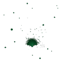 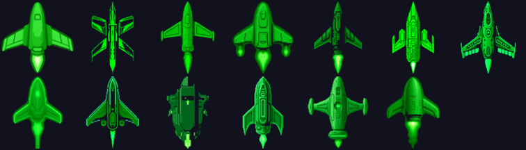

### Asteroids (1979)

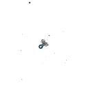 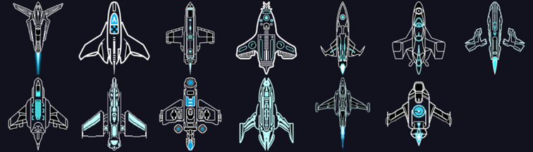

### Galaga (1981)

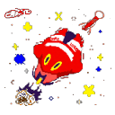 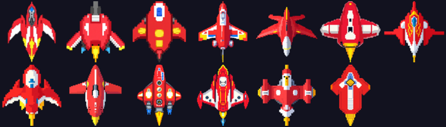

### River Raid (1982)

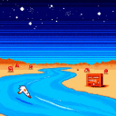 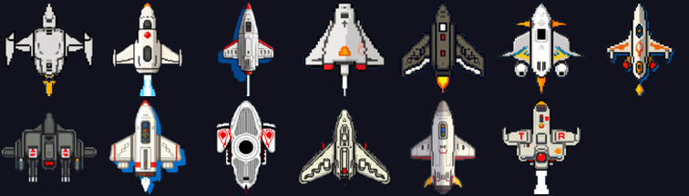

### R-Type (1987)

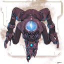 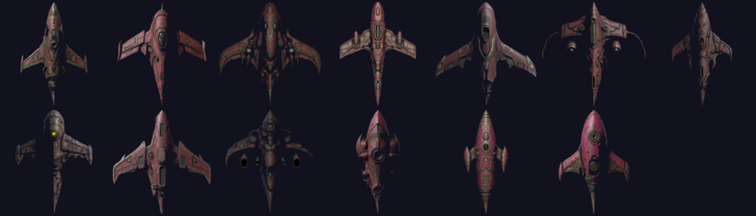

### Blazing Lazers (1989)

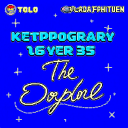 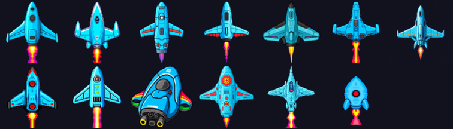

### Tyrian DOS (1995)

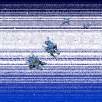 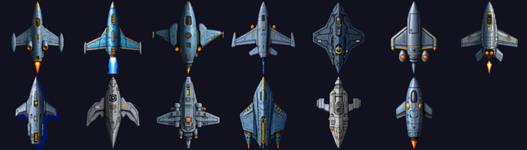

### Ikaruga (2001)

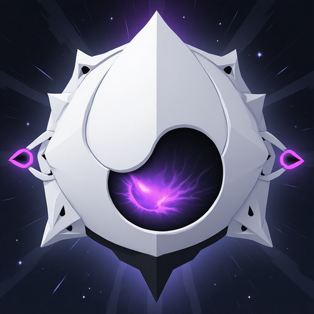 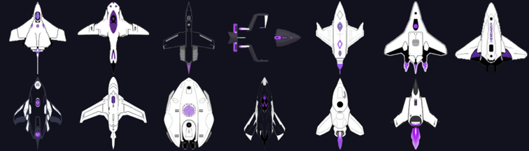

### Geometry Wars (2003)

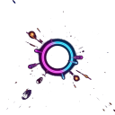 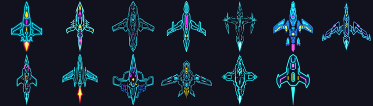

### Gradius V (2004)

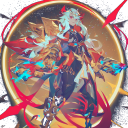 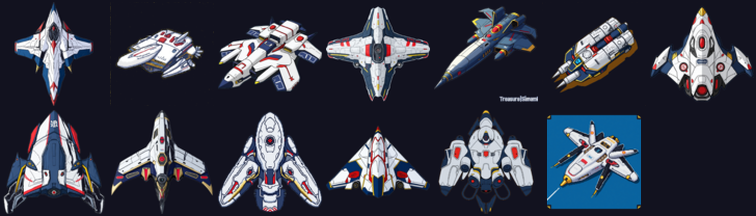

### Luftrausers (2014)

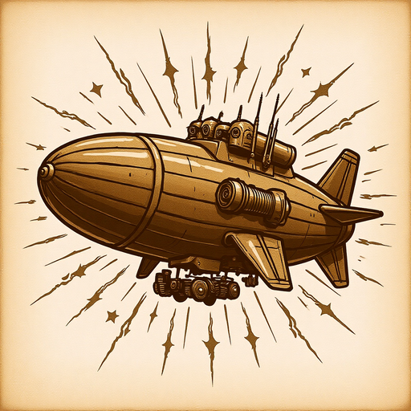 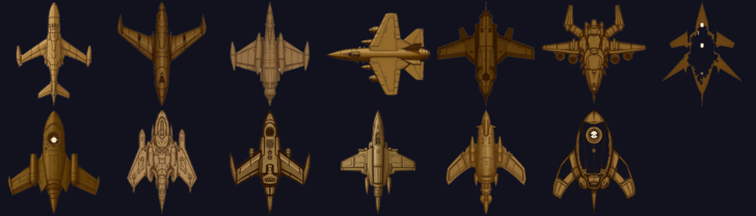

### Nuclear Throne (2015)

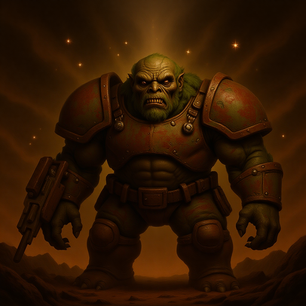 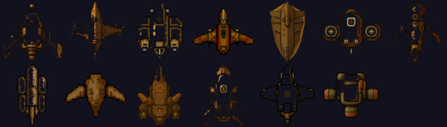

### Nex Machina (2017)

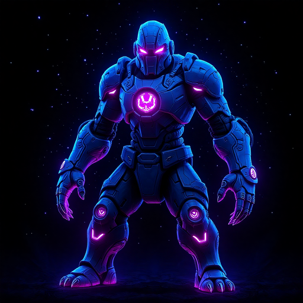 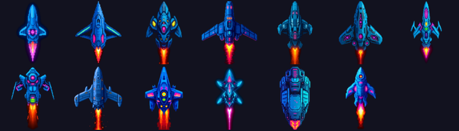

### Kiran (2026)

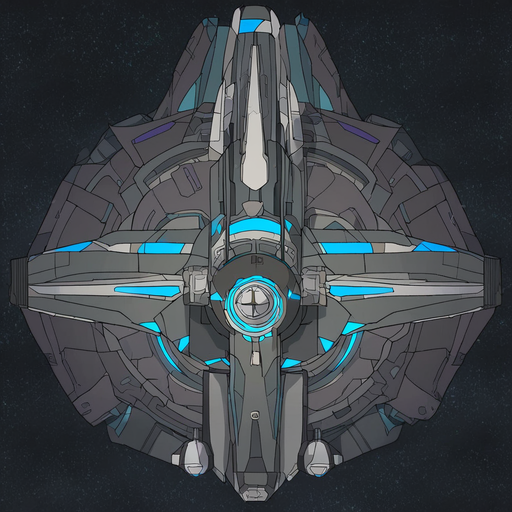 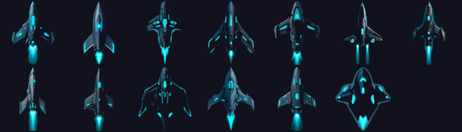

---

## Shader Legend

- **Bloom** — 3-pass blur composited over bright pixels; strength `0.5–1.5×`, threshold `0.6–0.8`
- **CRT** — scanline overlay + barrel curvature; only on pixel-art retro skins (`tyrian_dos`, `space_invaders`)
- **Vignette** — applied to all skins (radius `0.85–0.95`, softness `0.15–0.2`)
- **Chromatic aberration** — triggered on damage hit, not part of the static skin preset

## Adding a New Skin

1. Create `assets/skins/<name>/` with `sprites/`, `ui/`, `sfx/`, `backgrounds/` subdirs
2. Add 4 vessel sprites: `vessel_0.png` – `vessel_3.png`
3. Run `dart run tool/pack_atlas.dart` to rebuild the texture atlas
4. Register a `ShaderConfig` entry in `lib/rendering/shader_config.dart`
5. Add the skin ID to `SkinRegistry` in `lib/services/skin_registry.dart`
